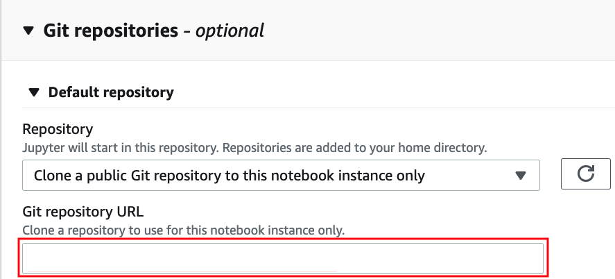

# Using Amazon SageMaker
:label:`sec_sagemaker`

Deep learning applications
may demand so much computational resource
that easily goes beyond
what your local machine can offer.
Cloud computing services
allow you to 
run GPU-intensive code of this book
more easily
using more powerful computers.
This section will introduce 
how to use Amazon SageMaker
to run the code of this book.

## Registration

First, we need to register an account at https://aws.amazon.com/.
For additional security,
using two-factor authentication 
is encouraged.
It is also a good idea to
set up detailed billing and spending alerts to
avoid any surprise,
e.g., 
when forgetting to stop running instances.
After logging into your AWS account, 
o to your [console](http://console.aws.amazon.com/) and search for "Amazon SageMaker" (see :numref:`fig_sagemaker`), 
then click it to open the SageMaker panel.


:width:`300px`
:label:`fig_sagemaker`

## Creating a SageMaker Instance

Next, let's create a notebook instance as described in :numref:`fig_sagemaker-create`.


:width:`400px`
:label:`fig_sagemaker-create`

SageMaker provides multiple [instance types](https://aws.amazon.com/sagemaker/pricing/instance-types/) with varying computational power and prices.
When creating a notebook instance,
we can specify its name and type.
In :numref:`fig_sagemaker-create-2`, we choose `ml.p3.2xlarge`: with one Tesla V100 GPU and an 8-core CPU, this instance is powerful enough for most of the book.


:width:`400px`
:label:`fig_sagemaker-create-2`

:begin_tab:`mxnet`
The entire book in the ipynb format for running with SageMaker is available at https://github.com/d2l-ai/d2l-en-sagemaker. We can specify this GitHub repository URL (:numref:`fig_sagemaker-create-3`) to allow SageMaker to clone it when creating the instance.


:width:`400px`
:label:`fig_sagemaker-create-3`
:end_tab:

:begin_tab:`pytorch`
The entire book in the ipynb format for running with SageMaker is available at https://github.com/d2l-ai/d2l-pytorch-sagemaker. We can specify this GitHub repository URL (:numref:`fig_sagemaker-create-3-pytorch`) to allow SageMaker to clone it when creating the instance.


:width:`400px`
:label:`fig_sagemaker-create-3-pytorch`
:end_tab:

:begin_tab:`tensorflow`
The entire book in the ipynb format for running with SageMaker is available at https://github.com/d2l-ai/d2l-tensorflow-sagemaker. We can specify this GitHub repository URL (:numref:`fig_sagemaker-create-3-tensorflow`) to allow SageMaker to clone it when creating the instance.


:width:`400px`
:label:`fig_sagemaker-create-3-tensorflow`
:end_tab:

## Running and Stopping an Instance

Creating an instance
may take a few minutes.
When the instance is ready,
click on the "Open Jupyter" link beside it (:numref:`fig_sagemaker-open`) so you can
edit and run all the Jupyter notebooks
of this book on this instance
(similar to steps in :numref:`sec_jupyter`).


:width:`400px`
:label:`fig_sagemaker-open`


After finishing your work,
do not forget to stop the instance to avoid 
being charged further (:numref:`fig_sagemaker-stop`).


:width:`300px`
:label:`fig_sagemaker-stop`


## Updating Notebooks

:begin_tab:`mxnet`
We will regularly update the notebooks in the [d2l-ai/d2l-en-sagemaker](https://github.com/d2l-ai/d2l-en-sagemaker) GitHub repository. You can simply use the `git pull` command to update to the latest version.
:end_tab:

:begin_tab:`pytorch`
We will regularly update the notebooks in the [d2l-ai/d2l-pytorch-sagemaker](https://github.com/d2l-ai/d2l-pytorch-sagemaker) GitHub repository. You can simply use the `git pull` command to update to the latest version.
:end_tab:

:begin_tab:`tensorflow`
We will regularly update the notebooks in the [d2l-ai/d2l-tensorflow-sagemaker](https://github.com/d2l-ai/d2l-tensorflow-sagemaker) GitHub repository. You can simply use the `git pull` command to update to the latest version.
:end_tab:

First, you need to open a terminal as shown in :numref:`fig_sagemaker-terminal`.


:width:`300px`
:label:`fig_sagemaker-terminal`

You may want to commit your local changes before pulling the updates. Alternatively, you can simply ignore all your local changes with the following commands in the terminal.

:begin_tab:`mxnet`

```bash
cd SageMaker/d2l-en-sagemaker/
git reset --hard
git pull
```


:end_tab:

:begin_tab:`pytorch`

```bash
cd SageMaker/d2l-pytorch-sagemaker/
git reset --hard
git pull
```


:end_tab:

:begin_tab:`tensorflow`

```bash
cd SageMaker/d2l-tensorflow-sagemaker/
git reset --hard
git pull
```


:end_tab:

## Summary

* We can launch and stop a Jupyter server through Amazon SageMaker to run this book.
* We can update notebooks via the terminal on the Amazon SageMaker instance.


## Exercises

1. Try to edit and run the code in this book using Amazon SageMaker.
1. Access the source code directory via the terminal.


[Discussions](https://discuss.d2l.ai/t/422)
