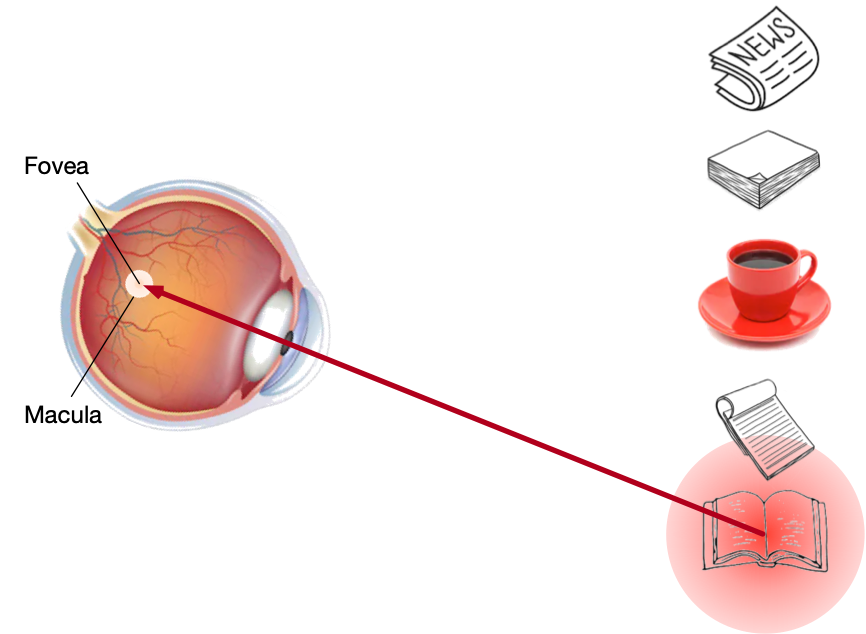

# Attentional Cues
:label:`sec_attention-cues`


Attention economy,

Biological attention.


## Eye in Cross Section

Saliency cue and task-dependent cue.


:width:`400px`
:label:`fig_eye-coffee`


:width:`400px`
:label:`fig_eye-book`


## Queries, Keys, and Values


Saliency cue corresponds to keys

Task-dependent cue corresponds to queries


## Visualization of Attention

```{.python .input}
import math
from d2l import mxnet as d2l
from mxnet import np, npx
npx.set_np()
```

```{.python .input}
#@tab pytorch
from d2l import torch as d2l
import torch
```

```{.python .input}
#@tab all
#@save
def show_heatmaps(matrices, xlabel, ylabel, titles=None, figsize=(2.5, 2.5),
                  cmap='Reds'):
    d2l.use_svg_display()
    num_rows, num_cols = matrices.shape[0], matrices.shape[1]
    fig, axes = d2l.plt.subplots(num_rows, num_cols, figsize=figsize,
                                 sharex=True, sharey=True, squeeze=False)
    for i, (row_axes, row_matrices) in enumerate(zip(axes, matrices)):
        for j, (ax, matrix) in enumerate(zip(row_axes, row_matrices)):
            pcm = ax.imshow(d2l.numpy(matrix), cmap=cmap)
            if i == num_rows - 1:
                ax.set_xlabel(xlabel)
            if j == 0:
                ax.set_ylabel(ylabel)
            if titles:
                ax.set_title(titles[j])
    fig.colorbar(pcm, ax=axes, shrink=0.6);
```

```{.python .input}
#@tab all
attention_weights = d2l.eye(10).reshape(1, 1, 10, 10)
show_heatmaps(attention_weights, xlabel='Keys', ylabel='Queries')
```
