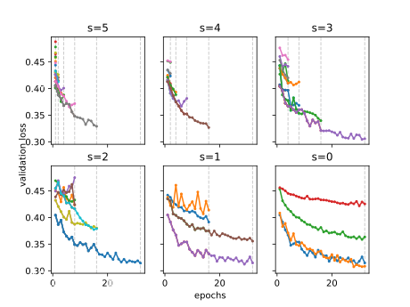

```{.python .input  n=1}
%load_ext d2lbook.tab
tab.interact_select(["pytorch"])
```

# Hyperband
:label:`sec_mf_hpo_hyperband`

In :numref:`sec_mf_hpo_sh`, we implemented and evaluated successive halving, a
simple yet effective multi-fidelity HPO algorithm. While this can greatly
improve upon random search, the choice of smallest rung level $r_{min}$ can have
a substantial impact on its performance. If $r_{min}$ is too small, our network
might not have enough time to learn anything, and even the best configurations
may be filtered out due to noisy observations. On the other hand, if $r_{min}$
is too large, we do not save much time evaluating the low fidelity signals (as
opposed to training until $r_{max}$), and the benefits of successive halving
are diminished.

Hyperband :cite:`li-iclr17` is an extension of successive halving that mitigates
the risk of setting $r_{min}$ too small. It runs successive halving as subroutine,
where each round of successive halving, called a bracket, balances between
$r_{min}$ and the number of initial configurations $N$, such that the same total
amount of resources per bracket is used.

Let's define $s_{max} = \lfloor log_{\eta} \frac{r_{max}}{r_{min}} \rfloor$.
Now for each bracket $s \in \{s_{max}, ..., 0\}$, we call successive halving with
$r_{min} = \eta^{-s} * r_{max}$ and the number of configurations
$N = \lceil \frac{s_{max} + 1}{s+1} * \eta^s \rceil$. Note that the last bracket
where $s=0$ evaluates all configurations on $r_{min} = r_{max}$, which means that
we effectively run random search. In practice, we execute brackets in a
round-robin fashion, which means we start with $s=s_{max}$ again once we
finished the loop. Given enough resources, we could also run all brackets in
parallel because configurations are sampled at random. We will discuss this case
in more detail in :numref:`sec_sh_async`.


:width:`400px`
:label:`hb`

We will use the same setup as in :numref:`sec_mf_hpo_sh`:

```{.python .input}
%%tab pytorch
from d2l import torch as d2l
```

```{.python .input  n=2}
%%tab all
import numpy as np
from scipy import stats
from collections import defaultdict

min_number_of_epochs = 2
max_number_of_epochs = 10
eta = 2

config_space = {
    "learning_rate": stats.loguniform(1e-2, 1),
    "batch_size": stats.randint(32, 256),
}
initial_config = {
    "learning_rate": 0.1,
    "batch_size": 128,
}
```

We implement a new scheduler, that maintains a `SuccessiveHalvingScheduler`
object for the current bracket.

```{.python .input  n=8}
%%tab all
class HyperbandScheduler(d2l.HPOScheduler):  #@save
    def __init__(self, searcher, eta, r_min, r_max):
        self.save_hyperparameters()
        self.s_max = int(np.ceil((np.log(r_max) - np.log(r_min)) / np.log(eta)))
        self.s = self.s_max
        self.successive_halving = d2l.SuccessiveHalvingScheduler(
            searcher=self.searcher,
            eta=self.eta,
            r_min=self.r_min,
            r_max=self.r_max,
            prefact=(self.s_max + 1) / (self.s + 1),
        )
        self.brackets = defaultdict(list)

    def suggest(self):
        return self.successive_halving.suggest()
```

The update function keeps track of the individual brackets. Once we finished a
bracket, we move on to the next, i.e. re-initialize successive halving with
different $r_{min}$ and $s$.

```{.python .input  n=9}
%%tab all
@d2l.add_to_class(HyperbandScheduler)  #@save
def update(self, config: dict, error: float, info=None):
    self.brackets[self.s].append((config["max_epochs"], error))
    self.successive_halving.update(config, error, info=info)
    # If the queue of successive halving is empty, than we finished this round
    # and start with a new round with different r_min and N
    if len(self.successive_halving.queue) == 0:
        self.s -= 1
        if self.s < 0:
            self.s = self.s_max
        self.successive_halving = d2l.SuccessiveHalvingScheduler(
            searcher=self.searcher,
            eta=self.eta,
            r_min=int(self.r_max * self.eta ** (-self.s)),
            r_max=self.r_max,
            prefact=(self.s_max + 1) / (self.s + 1),
        )
```

Let see how Hyperband performs on our neural network example.

```{.python .input  n=21}
%%tab all
searcher = d2l.RandomSearcher(config_space, initial_config=initial_config)
scheduler = HyperbandScheduler(
    searcher=searcher,
    eta=eta,
    r_min=min_number_of_epochs,
    r_max=max_number_of_epochs
)
tuner = d2l.HPOTuner(
    scheduler=scheduler,
    objective=d2l.hpo_objective_lenet,
)
tuner.run(number_of_trials=30)
```

We can also visualize the evaluations in different brackets of Hyperband.

```{.python .input  n=24}
%%tab all
for bi, bracket in scheduler.brackets.items():
    rung_levels = [xi[0] for xi in bracket]
    errors = [xi[1] for xi in bracket]
    d2l.plt.scatter(rung_levels, errors)
    d2l.plt.xlim(min_number_of_epochs - 0.5, max_number_of_epochs + 0.5)
    d2l.plt.xticks(
        np.arange(min_number_of_epochs, max_number_of_epochs + 1),
        np.arange(min_number_of_epochs, max_number_of_epochs + 1)
    )
    d2l.plt.title(f"bracket s={bi}")
    d2l.plt.ylabel("objective function")
    d2l.plt.xlabel("epochs")        
    d2l.plt.show()
```

## Summary

In this section, we implemented Hyperband, an extension of successive halving.
Hyperband mitigates the risk of choosing a suboptimal $r_{min}$, at the
expense of running several instances of successive halving sequentially.

## Exercises
