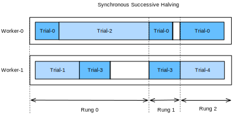
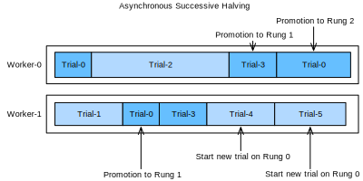

```{.python .input  n=1}
%load_ext d2lbook.tab
tab.interact_select(["pytorch"])
```

# Asynchronous Successive Halving

:label:`sec_sh_async`

As we have seen in :numref:`sec_rs_async`, we can accelerate HPO by
distributing the evaluation of hyperparameter configurations across either
multiple instances or multiples CPUs / GPUs on a single instance. However,
compared to random search, it is not straightforward to run
successive halving (SH) asynchronously in a distributed setting. Before we can
decide which configuration to run next, we first have to collect all
observations at the current rung level. This requires to
synchronize workers at each rung level. For example, for the lowest rung level
$r_{\text{min}}$, we first have to evaluate all $N = \eta^K$ configurations, before we
can promote the $\frac{1}{\eta}$ of them to the next rung level.

In any distributed system, synchronization typically implies idle time for workers.
First, we often observe high variations in training time across hyperparameter
configurations. For example, assuming the number of filters per layer is a
hyperparameter, then networks with less filters finish training faster than
networks with more filters, which implies idle worker time due to stragglers.
Moreover, the number of slots in a rung level is not always a multiple of the number
of workers, in which case some workers may even sit idle for a full batch.

Figure :numref:`synchronous_sh` shows the scheduling of synchronous SH with $\eta=2$
for four different trials with two workers. We start with evaluating Trial-0 and
Trial-1 for one epoch and immediately continue with the next two trials once they
are finished. We first have to wait until Trial-2 finishes, which takes
substantially more time than the other trials, before we can promote the best two
trials, i.e., Trial-0 and Trial-3 to the next rung level. This causes idle time for
Worker-1. Now, we continue with Rung 1. Also, here Trial-3 takes longer than Trial-0,
which leads to an additional ideling time of Worker-0. Once, we reach Rung-2, only
the best trial, Trial-0, remains which occupies only one worker. To avoid that
Worker-1 idles during that time, most implementaitons of SH continue already with
the next round, and start evaluating new trials (e.g Trial-4) on the first rung.


:label:`synchronous_sh`

Asynchronous successive halving (ASHA) :cite:`li-arxiv18` adapts SH to the asynchronous
parallel scenario. The main idea of ASHA is to promote configurations to the next rung
level as soon as we collected at least $\eta$ observations on the current rung level.
This decision rule may lead to suboptimal promotions: configurations can be promoted to the
next rung level, which in hindsight do not compare favourably against most others
at the same rung level. On the other hand, we get rid of all synchronization points
this way. In practice, such suboptimal initial promotions have only a modest impact on
performance, not only because the ranking of hyperparameter configurations is often
fairly consistent across rung levels, but also because rungs grow over time and
reflect the distribution of metric values at this level better and better. If a
worker is free, but no configuration can be promoted, we start a new configuration
with $r = r_{\text{min}}$, i.e the first rung level.

:numref:`asha` shows the scheduling of the same configurations for ASHA. Once Trial-1
finishes, we collect the results of two trials (i.e Trial-0 and Trial-1) and
immediately promote the better of them (Trial-0) to the next rung level. After Trial-0
finishes on rung 1, there are too few trials there in order to support a further
promotion. Hence, we continue with rung 0 and evaluate Trial-3. Once Trial-3 finishes,
Trial-2 is still pending. At this point we have 3 trials evaluated on rung 0 and one
trial evaluated already on rung 1. Since Trial-3 performs worse than Trial-0 at rung 0,
and $\eta=2$, we cannot promote any new trial yet, and Worker-1 starts Trial-4 from
scratch instead. However, once Trial-2 finishes and
scores worse than Trial-3, the latter is promoted towards rung 1. Afterwards, we
collected 2 evaluations on rung 1, which means we can now promote Trial-0 towards
rung 2. At the same time, Worker-1 continues with evaluating new trials (i.e.,
Trial-5) on rung 0.



:label:`asha`


```{.python .input}
from d2l import torch as d2l
import logging
logging.basicConfig(level=logging.INFO)
import matplotlib.pyplot as plt
from syne_tune.config_space import loguniform, randint
from syne_tune.backend.python_backend import PythonBackend
from syne_tune.optimizer.baselines import ASHA
from syne_tune import Tuner, StoppingCriterion
from syne_tune.experiments import load_experiment
```

## Objective Function

We will use *Syne Tune* with the same objective function as in
:numref:`sec_rs_async`.

```{.python .input  n=54}
def hpo_objective_lenet_synetune(learning_rate, batch_size, max_epochs):
    from d2l import torch as d2l
    from syne_tune import Reporter

    model = d2l.LeNet(lr=learning_rate, num_classes=10)
    trainer = d2l.HPOTrainer(max_epochs=1, num_gpus=1)
    data = d2l.FashionMNIST(batch_size=batch_size)
    model.apply_init([next(iter(data.get_dataloader(True)))[0]], d2l.init_cnn)
    report = Reporter()
    for epoch in range(1, max_epochs + 1):
        if epoch == 1:
            # Initialize the state of Trainer
            trainer.fit(model=model, data=data)
        else:
            trainer.fit_epoch()
        validation_error = d2l.numpy(trainer.validation_error().cpu())
        report(epoch=epoch, validation_error=float(validation_error))
```

We will also use the same configuration space as before:

```{.python .input  n=55}
min_number_of_epochs = 2
max_number_of_epochs = 10
eta = 2

config_space = {
    "learning_rate": loguniform(1e-2, 1),
    "batch_size": randint(32, 256),
    "max_epochs": max_number_of_epochs,
}
initial_config = {
    "learning_rate": 0.1,
    "batch_size": 128,
}
```

## Asynchronous Scheduler

First, we define the number of workers that evaluate trials concurrently. We
also need to specify how long we want to run random search, by defining an
upper limit on the total wall-clock time.

```{.python .input  n=56}
n_workers = 2  # Needs to be <= the number of available GPUs
max_wallclock_time = 12 * 60  # 12 minutes
```

The code for running ASHA is a simple variation of what we did for asynchronous
random search.

```{.python .input  n=56}
mode = "min"
metric = "validation_error"
resource_attr = "epoch"

scheduler = ASHA(
    config_space,
    metric=metric,
    mode=mode,
    points_to_evaluate=[initial_config],
    max_resource_attr="max_epochs",
    resource_attr=resource_attr,
    grace_period=min_number_of_epochs,
    reduction_factor=eta,
)
```

Here, `metric` and `resource_attr` specify the key names used with the `report`
callback, and `max_resource_attr` denotes which input to the objective function
corresponds to $r_{\text{max}}$. Moreover, `grace_period` provides $r_{\text{min}}$, and
`reduction_factor` is $\eta$. Now, we can run Syne Tune as before:

```{.python .input  n=57}
trial_backend = PythonBackend(
    tune_function=hpo_objective_lenet_synetune,
    config_space=config_space,
)

stop_criterion = StoppingCriterion(max_wallclock_time=max_wallclock_time)
tuner = Tuner(
    trial_backend=trial_backend,
    scheduler=scheduler,
    stop_criterion=stop_criterion,
    n_workers=n_workers,
)
tuner.run()
```

Note that we are running a variant of ASHA where underperforming trials are
stopped early. This is different to our implementation in
:numref:`sec_mf_hpo_sh`, where each training job is started with a fixed
`max_epochs`. In the latter case, a well-performing trial which reaches the
full 10 epochs, first needs to train 1, then 2, then 4, then 8 epochs, each
time starting from scratch. This type of pause-and-resume scheduling can be
implemented efficiently by checkpointing the training state after each epoch,
but we avoid this extra complexity here. After the experiment has finished,
we can retrieve and plot results.

```{.python .input  n=59}
d2l.set_figsize()
e = load_experiment(tuner.name)
e.plot()
```

## Visualize the Optimization Process

Once more, we visualize the learning curves of every trial (each color in the plot represents a trial). Compare this to
asynchronous random search in :numref:`sec_rs_async`. As we have seen for
successive halving in :numref:`sec_mf_hpo`, most of the trials are stopped
at 1 or 2 epochs ($r_{\text{min}}$ or $\eta * r_{\text{min}}$). However, trials do not stop
at the same point, because they require different amount of time per epoch. If
we ran standard successive halving instead of ASHA, we would need to synchronize
our workers, before we can promote configurations to the next rung level.

```{.python .input  n=60}
d2l.set_figsize([6, 2.5])
results = e.results
for trial_id in results.trial_id.unique():
    df = results[results["trial_id"] == trial_id]
    d2l.plt.plot(
        df["st_tuner_time"],
        df["validation_error"],
        marker="o"
    )
d2l.plt.xlabel("wall-clock time")
d2l.plt.ylabel("objective function")
```

## Summary

Compared to random search, successive halving is not quite as trivial to run in
an asynchronous distributed setting. To avoid synchronisation points, we promote
configurations as quickly as possible to the next rung level, even if this means
promoting some wrong ones. In practice, this usually does not hurt much, and the
gains of asynchronous versus synchronous scheduling are usually much higher
than the loss of the suboptimal decision making.
