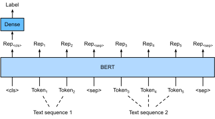

# Fine-Tuning BERT for Sequence-Level and Token-Level Applications
:label:`sec_finetuning-bert`

In the previous sections of this chapter,
we have designed different models for natural language processing applications,
such as based on RNNs, CNNs, attention, and MLPs.
These models are helpful when there is space or time constraint,
however,
crafting a specific model for every natural language processing task
is practically infeasible.
In :numref:`sec_bert`,
we introduced a pretraining model, BERT,
that requires minimal architecture changes
for a wide range of natural language processing tasks.
One one hand,
at the time of its proposal,
BERT improved the state of the art on various natural language processing tasks.
On the other hand,
as noted in :numref:`sec_bert-pretraining`,
the two versions of the original BERT model
come with 110 million and 340 million parameters.
Thus, when there are sufficient computational resources,
we may consider
fine-tuning BERT for downstream natural language processing applications.

In the following,
we generalize a subset of natural language processing applications
as sequence-level and token-level.
On the sequence level,
we introduce how to fine-tune BERT for single text classification and text pair classification, such as sentiment analysis and natural language inference,
which we have already examined.
On the token level, we will briefly introduce new applications
such as text tagging and question answering
and shed light on how BERT can fit in their problem settings.
During fine-tuning,
the "minimal architecture changes" required by BERT across different applications
are the extra fully-connected layers.

## Single Text Classification

Single text classification takes a single text sequence as the input and returns its classification result as the output.
Besides sentiment analysis,
the Corpus of Linguistic Acceptability (CoLA)
is a dataset for judging
whether a given sentence is grammatically acceptable or not :cite:`Warstadt.Singh.Bowman.2019`.
For instance, "I should study." is acceptable but "I should studying." is not.

:label:`fig_bert-one-seq`

## Text Pair Classification

:label:`fig_bert-two-seqs`

## Text Tagging

:label:`fig_bert-tagging`

## Question Answering

:label:`fig_bert-qa`

## Summary

* Fine-tune BERT.

## Exercises

1. Let us design a search engine algorithm for news articles. When the system receives an query (e.g., "oil industry during the coronavirus outbreak"), it should return a ranked list of news articles that are most relevant to the query. Suppose that we have a huge pool of news articles and a large number of queries. To simplify the problem, suppose that the most relevant article has been labeled for each query. How can we apply negative sampling (see :numref:`subsec_negative-sampling`) and BERT in the algorithm design?
1. How can we leverage BERT in text generation tasks such as machine translation?

## [Discussions](https://discuss.mxnet.io/t/5882)

