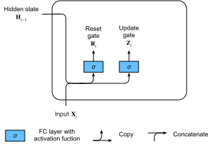
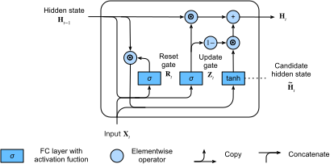

# Gated Recurrent Unit (GRU)

@TODO(smolix/astonzhang): the data set was just changed from lyrics to time machine, so descriptions/hyperparameters have to change.

In the previous section, we discussed gradient calculation methods in recurrent neural networks. We found that, when the number of time steps is large or the time step is small, the gradients in recurrent neural networks are prone to vanishing or explosion. Although gradient clipping can cope with gradient explosion, it cannot solve the vanishing gradient problem. Therefore, it is generally quite difficult to capture dependencies for time series with large time step distances during the actual use of recurrent neural networks.

Gated recurrent neural networks were proposed as a way to better capture dependencies for time series with large time step distances. Such a network uses learnable gates to control the flow of information. One common type of gated recurrent neural network is a gated recurrent unit (GRU) [1, 2]. Another common type of gated recurrent neural network is discussed in the next section.


## Gated Recurrent Units

In what follows, we will discuss the design of GRUs. These networks introduce the reset gate and update gate concepts to change the method used to calculate hidden states in recurrent neural networks.

### Reset Gates and Update Gates

As shown in Figure 6.4, the inputs for both reset gates and update gates in GRU are the current time step input $\boldsymbol{X}_t$ and the hidden state of the previous time step $\boldsymbol{H}_{t-1}$. The output is computed by the fully connected layer with a sigmoid function as its activation function.





Here, we assume there are $h$ hidden units and, for a given time step $t$, the mini-batch input is $\boldsymbol{X}_t \in \mathbb{R}^{n \times d}$ (number of examples: $n$, number of inputs: $d$）and the hidden state of the last time step is $\boldsymbol{H}_{t-1} \in \mathbb{R}^{n \times h}$. Then, the reset gate $\boldsymbol{R}_t \in \mathbb{R}^{n \times h}$ and update gate $\boldsymbol{Z}_t \in \mathbb{R}^{n \times h}$ computation is as follows:

$$
\begin{aligned}
\boldsymbol{R}_t = \sigma(\boldsymbol{X}_t \boldsymbol{W}_{xr} + \boldsymbol{H}_{t-1} \boldsymbol{W}_{hr} + \boldsymbol{b}_r),\\
\boldsymbol{Z}_t = \sigma(\boldsymbol{X}_t \boldsymbol{W}_{xz} + \boldsymbol{H}_{t-1} \boldsymbol{W}_{hz} + \boldsymbol{b}_z),
\end{aligned}
$$

Here, $\boldsymbol{W}_{xr}, \boldsymbol{W}_{xz} \in \mathbb{R}^{d \times h}$ and $\boldsymbol{W}_{hr}, \boldsymbol{W}_{hz} \in \mathbb{R}^{h \times h}$ are weight parameters and $\boldsymbol{b}_r, \boldsymbol{b}_z \in \mathbb{R}^{1 \times h}$ is a bias parameter. As described in the ["Multilayer Perceptron"](../chapter_deep-learning-basics/mlp.md) section, a sigmoid function can transform element values between 0 and 1. Therefore, the range of each element in the reset gate $\boldsymbol{R}_t$ and update gate $\boldsymbol{Z}_t$ is $[0, 1]$.

### Candidate Hidden States

Next, the GRU computes candidate hidden states to facilitate subsequent hidden state computation. As shown in Figure 6.5, we perform multiplication by element between the current time step reset gate output and previous time step hidden state (symbol: $\odot$). If the element value in the reset gate approaches 0, this means that it resets the value of the corresponding hidden state element to 0, discarding the hidden state from the previous time step. If the element value approaches 1, this indicates that the hidden state from the previous time step is retained. Then, the result of multiplication by element is concatenated with the current time step input to compute candidate hidden states in a fully connected layer with a tanh activation function. The range of all element values is $[-1, 1]$.


For time step $t$, the candidate hidden state $\tilde{\boldsymbol{H}}_t \in \mathbb{R}^{n \times h}$ is computed by the following formula:

$$\tilde{\boldsymbol{H}}_t = \text{tanh}(\boldsymbol{X}_t \boldsymbol{W}_{xh} + \left(\boldsymbol{R}_t \odot \boldsymbol{H}_{t-1}\right) \boldsymbol{W}_{hh} + \boldsymbol{b}_h),$$

Here, $\boldsymbol{W}_{xh} \in \mathbb{R}^{d \times h}$ and $\boldsymbol{W}_{hh} \in \mathbb{R}^{h \times h}$ are weight parameters and $\boldsymbol{b}_h \in \mathbb{R}^{1 \times h}$ is a bias parameter. From the formula above, we can see that the reset gate controls how the hidden state of the previous time step enters into the candidate hidden state of the current time step. In addition, the hidden state of the previous time step may contain all historical information of the time series up to the previous time step. Thus, the reset gate can be used to discard historical information that has no bearing on predictions.

### Hidden States

Finally, the computation of the hidden state $\boldsymbol{H}_t \in \mathbb{R}^{n \times h}$ for time step $t$ uses the current time step's update gate $\boldsymbol{Z}_t$ to combine the previous time step hidden state $\boldsymbol{H}_{t-1}$ and current time step candidate hidden state $\tilde{\boldsymbol{H}}_t$:

$$\boldsymbol{H}_t = \boldsymbol{Z}_t \odot \boldsymbol{H}_{t-1}  + (1 - \boldsymbol{Z}_t) \odot \tilde{\boldsymbol{H}}_t.$$





It should be noted that update gates can control how hidden states should be updated by candidate hidden states containing current time step information, as shown in Figure 6.6. Here, we assume that the update gate is always approximately 1 between the time steps $t'$ and $t$ ($t' < t$). Therefore, the input information between the time steps $t'$ and $t$ almost never enters the hidden state $\boldsymbol{H}_t$ for time step $t$. In fact, we can think of it like this: The hidden state of an earlier time $\boldsymbol{H}_{t'-1}$ is saved over time and passed to the current time step $t$. This design can cope with the vanishing gradient problem in recurrent neural networks and better capture dependencies for time series with large time step distances.

We can summarize the design of GRUs as follows:

* Reset gates help capture short-term dependencies in time series.
* Update gates help capture long-term dependencies in time series.

## Read the Data Set

To implement and display a GRU, we will again use the Jay Chou lyrics data set to train the model to compose song lyrics. The implementation, except for the GRU, has already been described in the ["Recurrent Neural Network"](rnn.md) section. The code for reading the data set is given below:

```{.python .input  n=1}
import sys
sys.path.insert(0, '..')

import d2l
from mxnet import nd
from mxnet.gluon import rnn

(corpus_indices, char_to_idx, idx_to_char,
 vocab_size) = d2l.load_data_time_machine()
```

## Implementation from Scratch

We will start by showing how to implement a GRU from scratch.

### Initialize Model Parameters

The code below initializes the model parameters. The hyper-parameter `num_hiddens` defines the number of hidden units.

```{.python .input  n=2}
num_inputs, num_hiddens, num_outputs = vocab_size, 256, vocab_size
ctx = d2l.try_gpu()

def get_params():
    def _one(shape):
        return nd.random.normal(scale=0.01, shape=shape, ctx=ctx)

    def _three():
        return (_one((num_inputs, num_hiddens)),
                _one((num_hiddens, num_hiddens)),
                nd.zeros(num_hiddens, ctx=ctx))

    W_xz, W_hz, b_z = _three()  # Update gate parameter
    W_xr, W_hr, b_r = _three()  # Reset gate parameter
    W_xh, W_hh, b_h = _three()  # Candidate hidden state parameter
    # Output layer parameters
    W_hq = _one((num_hiddens, num_outputs))
    b_q = nd.zeros(num_outputs, ctx=ctx)
    # Create gradient
    params = [W_xz, W_hz, b_z, W_xr, W_hr, b_r, W_xh, W_hh, b_h, W_hq, b_q]
    for param in params:
        param.attach_grad()
    return params
```

### Define the Model

Now we will define the hidden state initialization function `init_gru_state`. Just like the `init_rnn_state` function defined in the ["Implementation of the Recurrent Neural Network from Scratch"](rnn-scratch.md) section, this function returns a tuple composed of an NDArray with a shape (batch size, number of hidden units) value of 0.

```{.python .input  n=3}
def init_gru_state(batch_size, num_hiddens, ctx):
    return (nd.zeros(shape=(batch_size, num_hiddens), ctx=ctx), )
```

Below, we define the model based on GRU computing expressions.

```{.python .input  n=4}
def gru(inputs, state, params):
    W_xz, W_hz, b_z, W_xr, W_hr, b_r, W_xh, W_hh, b_h, W_hq, b_q = params
    H, = state
    outputs = []
    for X in inputs:
        Z = nd.sigmoid(nd.dot(X, W_xz) + nd.dot(H, W_hz) + b_z)
        R = nd.sigmoid(nd.dot(X, W_xr) + nd.dot(H, W_hr) + b_r)
        H_tilda = nd.tanh(nd.dot(X, W_xh) + R * nd.dot(H, W_hh) + b_h)
        H = Z * H + (1 - Z) * H_tilda
        Y = nd.dot(H, W_hq) + b_q
        outputs.append(Y)
    return outputs, (H,)
```

### Train the Model and Write Lyrics

During model training, we only use adjacent examples. After setting the hyper-parameters, we train and model and create a 50 character string of lyrics based on the prefixes "separate" and "not separated".

```{.python .input  n=5}
num_epochs, num_steps, batch_size, lr, clipping_theta = 160, 35, 32, 1e2, 1e-2
pred_period, pred_len, prefixes = 40, 50, ['traveller', 'time traveller']
```

We create a string of lyrics based on the currently trained model every 40 epochs.

```{.python .input}
d2l.train_and_predict_rnn(gru, get_params, init_gru_state, num_hiddens,
                          vocab_size, ctx, corpus_indices, idx_to_char,
                          char_to_idx, False, num_epochs, num_steps, lr,
                          clipping_theta, batch_size, pred_period, pred_len,
                          prefixes)
```

## Concise Implementation

In Gluon, we can directly call the `GRU` class in the `rnn` module.

```{.python .input  n=6}
gru_layer = rnn.GRU(num_hiddens)
model = d2l.RNNModel(gru_layer, vocab_size)
d2l.train_and_predict_rnn_gluon(model, num_hiddens, vocab_size, ctx,
                                corpus_indices, idx_to_char, char_to_idx,
                                num_epochs, num_steps, lr, clipping_theta,
                                batch_size, pred_period, pred_len, prefixes)
```

## Summary

* Gated recurrent neural networks can better capture dependencies for time series with large time step distances.
* GRUs introduce the reset gate and update gate concepts to change the method used to calculate hidden states in recurrent neural networks. They include reset gates, update gates, candidate hidden states, and hidden states.
* Reset gates help capture short-term dependencies in time series.
* Update gates help capture long-term dependencies in time series.


## Problems

* Assume that time step $t' < t$. If we only want to use the input for time step $t'$ to predict the output at time step $t$, what are the best values for the reset and update gates for each time step?
* Adjust the hyper-parameters and observe and analyze the impact on running time, perplexity, and the written lyrics.
* Compare the running times of a GRU and ungated recurrent neural network under the same conditions.

## References

[1] Cho, K., Van Merriënboer, B., Bahdanau, D., & Bengio, Y. (2014). On the properties of neural machine translation: Encoder-decoder approaches. arXiv preprint arXiv:1409.1259.

[2] Chung, J., Gulcehre, C., Cho, K., & Bengio, Y. (2014). Empirical evaluation of gated recurrent neural networks on sequence modeling. arXiv preprint arXiv:1412.3555.

## Discuss on our Forum

<div id="discuss" topic_id="2367"></div>
